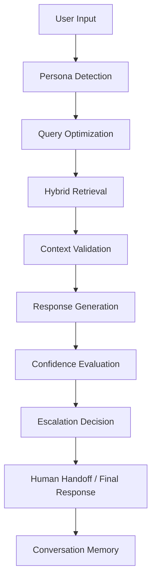

# Persona-Adaptive Customer Support Agent

[](https://www.python.org/)
[](LICENSE)
[]
[](https://github.com/<owner>/<repo>/actions/workflows/ci.yml)
[](https://github.com/<owner>/<repo>/actions/workflows/ci.yml)


## Overview

`customer_support_agent` is a persona-adaptive support assistant built in Python. It combines hybrid retrieval, persona-aware response generation, configurable escalation, and LangGraph state management to help automated customer support stay grounded and safe.

## Highlights

- Persona-aware support responses based on user tone and intent
- Retrieval-augmented generation using dense + BM25 ranking
- Strict grounding safeguards and escalation rules
- Human handoff summary for sensitive or low-confidence conversations
- CLI and Streamlit interfaces for developer evaluation
- Production-ready configuration, logging, and container deployment

## Quick start

```bash
git clone https://github.com/<your-org>/customer_support_agent.git
cd customer_support_agent
python -m venv .venv
source .venv/bin/activate  # Windows: .venv\Scripts\activate
python -m pip install --upgrade pip
python -m pip install -e .[dev]
cp .env.example .env
```

Run a quick CLI request:

```bash
python -m support_agent.presentation.cli run --message "How can I reset my password?"
```

Demo (quick end-to-end)

1. Ingest a tiny demo KB (creates `data/vector_store/demo_store.json`):

```bash
python examples/demo/ingest_demo.py
```

2. Run a local demo runner that queries the demo KB and prints a grounded answer:

```bash
python examples/demo/run_demo.py
```

3. (Optional) Launch the analytics Streamlit dashboard:

```bash
python -m support_agent.presentation.streamlit_app
```

These demo steps require only the dev dependencies and do not call external LLM APIs.

## Project Showcase

See `PROJECT_SHOWCASE.md` for a concise presentation designed for technical interviews and architecture reviews. It explains the problem, architecture, RAG pipeline, LangGraph usage, persona detection, escalation, and interview talking points.

## Interview talking points (quick)

- Clean Architecture: domain, application, infrastructure, presentation separation.
- RAG pipeline: dense + BM25 + RRF fusion.
- Safety: prompt engineering for grounded answers and escalation policies.
- Observability: structlog, DI container, and planned Prometheus metrics.
- Deployment: Docker + compose; recommendations for production (managed vector DB, autoscaling).


## Architecture

This project is structured around a modular support workflow:



For a deeper breakdown, see `docs/architecture.md`.

## Repository structure

- `src/support_agent` — core application package
- `src/support_agent/application` — service orchestration, persona detection, response generation, ingestion, retrieval
- `src/support_agent/infrastructure` — adapters for LLMs, embeddings, loaders, retrievers, telemetry
- `src/support_agent/domain` — request, response, persona, memory, escalation models
- `src/support_agent/presentation` — CLI and Streamlit app
- `src/support_agent/prompts` — prompt templates for persona detection, handoff, and responses
- `tests` — unit and integration coverage
- `docs` — architecture, deployment, examples, and limitations

## Key concepts

### Persona detection

The agent classifies the customer persona from recent conversation context and applies a tone-specific response policy. If persona evidence is weak, the system falls back to safer support styles.

### Hybrid retrieval

Content is indexed from raw documents and retrieved with both dense embeddings and BM25 lexical search. The results are fused using Reciprocal Rank Fusion to maximize grounding quality.

### Grounded response generation

Responses are generated with persona-specific prompts and are conditioned on retrieved context. If context is insufficient or confidence falls below threshold, the system triggers escalation instead of answering.

### Escalation and handoff

Escalation is driven by configurable rules for low confidence, unsupported content, billing or legal issues, repeated dissatisfaction, and explicit user requests.

## Documentation

- `docs/installation.md` — local setup and development
- `docs/deployment.md` — Docker and production deployment
- `docs/architecture.md` — system design and component boundaries
- `docs/sequence_diagram.md` — sequence of request handling
- `docs/workflow_diagram.md` — workflow graph overview
- `docs/example_conversations.md` — sample queries and answers
- `docs/known_limitations.md` — current project limitations
- `docs/future_improvements.md` — roadmap and improvements

## Environment variables

Use `.env.example` as a starting point. Key settings include:

- `OPENAI_API_KEY`
- `SUPPORT_AGENT_DEFAULT_PERSONA`
- `SUPPORT_AGENT_RETRIEVAL_CONFIDENCE_THRESHOLD`
- `SUPPORT_AGENT_CACHE_TTL_SECONDS`
- `SUPPORT_AGENT_MAX_REQUESTS_PER_MINUTE`
- `SUPPORT_AGENT_LOG_LEVEL`

## Testing

Run the test suite with:

```bash
pytest -q
```

CI: a GitHub Actions workflow `CI` runs linting, type checks and tests on pushes and PRs. Replace the badge owner/repo placeholders above with your GitHub org and repository name to enable the badge.

## Formatting and linting

This project supports `pre-commit` for quality checks. Install and run:

```bash
pre-commit install
pre-commit run --all-files
```

## Contributing

See `CONTRIBUTING.md` for local development, branching, and pull request guidance.

## License

This project is licensed under the MIT License. See `LICENSE`.
