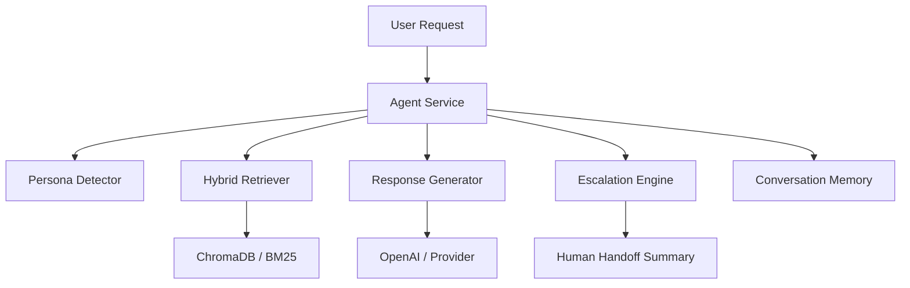

# Architecture

This document provides an overview of the system architecture. See `README.md` for the high-level mermaid diagram. The system is organized using a Clean Architecture approach:

- `src/support_agent/domain` — core domain models (personas, documents, responses, escalation)
- `src/support_agent/application` — orchestration and use-cases (persona detection, retrieval orchestration, response generation)
- `src/support_agent/infrastructure` — adapters and gateways (LLM client, vector store, loaders, retrievers)
- `src/support_agent/presentation` — CLI and Streamlit UI

For sequence and workflow diagrams, see `sequence_diagram.md` and `workflow_diagram.md`.
# Architecture

This project is designed as a production-ready customer support agent that combines persona-aware reasoning with retrieval-augmented generation and escalation management.

## System overview

The application is built around an orchestrated workflow that separates input processing, persona classification, retrieval, response generation, confidence evaluation, escalation, and memory management.

### Core layers

- `presentation` — CLI and Streamlit entry points.
- `application` — service orchestration and domain-specific business logic.
- `infrastructure` — connectors for LLMs, embeddings, retrieval stores, and telemetry.
- `domain` — typed models for requests, responses, personas, escalations, and memory.
- `prompts` — reusable prompt templates used throughout the workflow.

## Architecture diagram

## Retrieval pipeline

Document ingestion is isolated from retrieval and ranking:

1. Document loaders import PDF, DOCX, Markdown, and TXT files.
2. The chunker splits content into deterministic chunks with metadata.
3. Chunks are embedded and indexed in Chroma via `ChromaVectorStore`.
4. BM25 runs lexical search in parallel, and results are fused using reciprocal rank fusion.
5. The retrieval result includes hybrid scores, citations, and metadata for grounding.

### Grounding and safety

- The response generator rejects answers when retrieval confidence is below threshold.
- Prompt templates strictly enforce citation requirements and no unsupported facts.
- Escalation is triggered instead of generating answers for sensitive or unsupported queries.

## Persona detection

Persona detection uses a scored set of persona definitions:

- persona name
- description and tone guidance
- positive and negative lexical indicators
- tie-break priority and fallback behavior

The detector computes confidence from lexical matches and can fall back to a safe persona when evidence is weak.

### Supported personas

- `Technical Expert`
- `Frustrated User`
- `Business Executive`

## LangGraph workflow

The request handling workflow is implemented as a LangGraph graph to preserve state and make each step explicit.

### Node responsibilities

- `UserInputNode`: normalize text and initialize graph state.
- `PersonaDetectionNode`: classify persona and compute confidence.
- `QueryOptimizationNode`: prepare a retrieval-friendly query.
- `HybridRetrievalNode`: gather context from dense and lexical retrievers.
- `ContextValidationNode`: ensure retrieved context is adequate.
- `ResponseGenerationNode`: generate a grounded answer or escalation request.
- `ConfidenceEvaluationNode`: evaluate whether the response is reliable.
- `EscalationDecisionNode`: choose human handoff when needed.
- `HumanHandoffNode`: create a structured handoff summary.
- `FinalResponseNode`: prepare the response payload for callers.

## Escalation engine

`EscalationEngine` is independent from node wiring and centralizes rule-based escalation decisions.

It can trigger escalation for:

- low retrieval confidence
- missing or irrelevant documents
- repeated negative sentiment
- billing/legal/overdue requests
- explicit user escalation demands

## Memory management

Conversation memory preserves session context using LangGraph checkpointing and a dedicated `ConversationMemoryState` model. It supports:

- session restoration
- trimmed history for follow-ups
- persona reuse across turns
- citation and confidence tracking

## Configuration

Most behavior is configurable through environment variables and settings in `src/support_agent/config/settings.py`.

Key values include:

- retrieval thresholds
- cache TTL
- rate limits
- logging levels
- memory budgets

For full deployment guidance, refer to `docs/deployment.md`.

- `ConversationMemoryState.trimmed_history()` estimates prompt tokens using a lightweight character heuristic.
- Recent turns are selected from newest to oldest until the configured token budget is reached.
- Long-running sessions retain bounded turns and bounded retrieved-document citations.

Configuration:

- `MEMORY_MAX_TURNS`
- `MEMORY_TOKEN_BUDGET`
