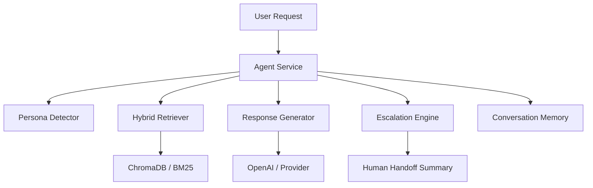

# Architecture Diagram

```mermaid
graph TB
    User[User Request] --> API[Agent Service]
    API --> Persona[Persona Detector]
    API --> Retrieval[Hybrid Retriever]
    Retrieval --> Storage[ChromaDB / BM25]
    API --> Response[Response Generator]
    Response --> LLM[OpenAI / Provider]
    API --> Escalation[Escalation Engine]
    Escalation --> Handoff[Human Handoff Summary]
    API --> Memory[Conversation Memory]
```
