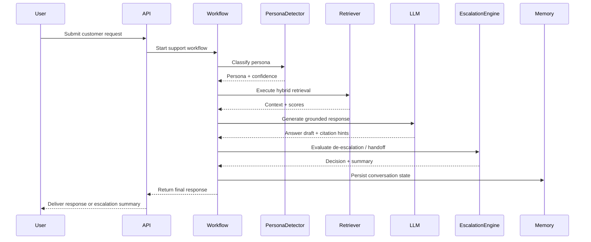

# Sequence Diagram


```mermaid
sequenceDiagram
    participant User
    participant API
    participant Workflow
    participant PersonaDetector
    participant Retriever
    participant LLM
    participant EscalationEngine
    participant Memory

    User->>API: Submit customer request
    API->>Workflow: Start support workflow
    Workflow->>PersonaDetector: Classify persona
    PersonaDetector-->>Workflow: Persona + confidence
    Workflow->>Retriever: Execute hybrid retrieval
    Retriever-->>Workflow: Context + scores
    Workflow->>LLM: Generate grounded response
    LLM-->>Workflow: Answer draft + citation hints
    Workflow->>EscalationEngine: Evaluate de-escalation / handoff
    EscalationEngine-->>Workflow: Decision + summary
    Workflow->>Memory: Persist conversation state
    Workflow-->>API: Return final response
    API-->>User: Deliver response or escalation summary
```
```
