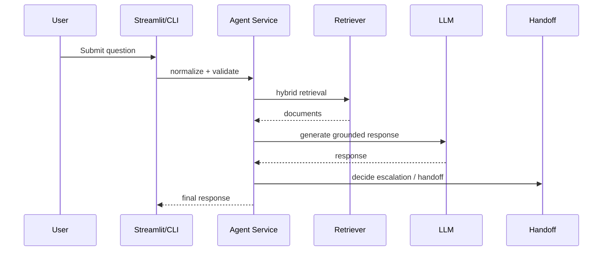
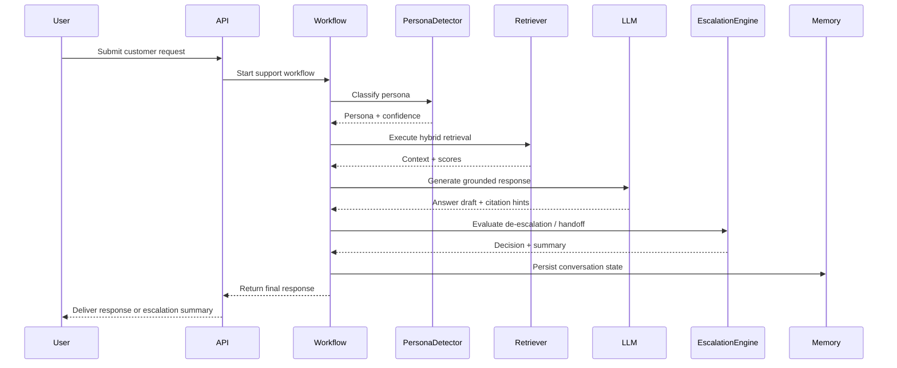

```mermaid
sequenceDiagram
    participant U as User
    participant UI as Streamlit/CLI
    participant A as Agent Service
    participant R as Retriever
    participant L as LLM
    participant H as Handoff

    U->>UI: Submit question
    UI->>A: normalize + validate
    A->>R: hybrid retrieval
    R-->>A: documents
    A->>L: generate grounded response
    L-->>A: response
    A->>H: decide escalation / handoff
    A-->>UI: final response
```
# Sequence Diagram


```mermaid
sequenceDiagram
    participant User
    participant API
    participant Workflow
    participant PersonaDetector
    participant Retriever
    participant LLM
    participant EscalationEngine
    participant Memory

    User->>API: Submit customer request
    API->>Workflow: Start support workflow
    Workflow->>PersonaDetector: Classify persona
    PersonaDetector-->>Workflow: Persona + confidence
    Workflow->>Retriever: Execute hybrid retrieval
    Retriever-->>Workflow: Context + scores
    Workflow->>LLM: Generate grounded response
    LLM-->>Workflow: Answer draft + citation hints
    Workflow->>EscalationEngine: Evaluate de-escalation / handoff
    EscalationEngine-->>Workflow: Decision + summary
    Workflow->>Memory: Persist conversation state
    Workflow-->>API: Return final response
    API-->>User: Deliver response or escalation summary
```
```
