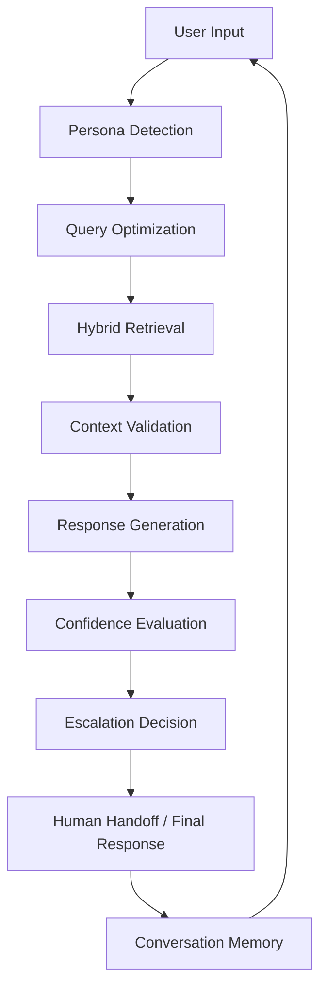

# Workflow Diagram


```mermaid
graph TD
    A[User Input] --> B[Persona Detection]
    B --> C[Query Optimization]
    C --> D[Hybrid Retrieval]
    D --> E[Context Validation]
    E --> F[Response Generation]
    F --> G[Confidence Evaluation]
    G --> H[Escalation Decision]
    H --> I[Human Handoff / Final Response]
    I --> J[Conversation Memory]
    J --> A
```
```
